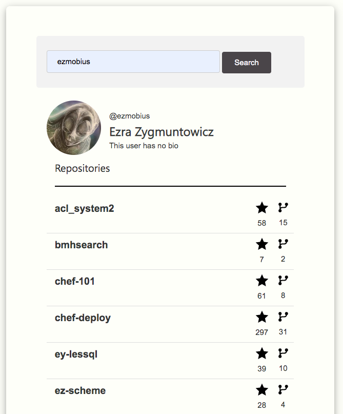
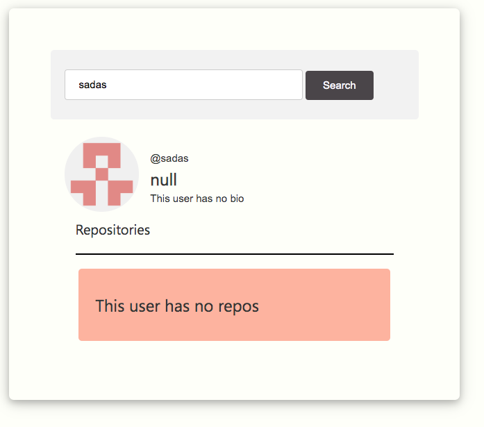
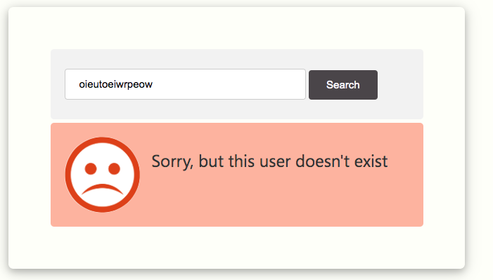

# GITHUB USER FINDER

## HOW TO START

In the project directory, you should

### `npm install`
Install all the dependencies required for the project.

### `webpack`
To build the dist folder

### `npm start`
To run the dev-server

### `npm dev'
Webpack development mode

### `npm prod'
Webpack production mode

## Technologies used

- Build System: Webpack 4.1+
- ES6+
- SASS

## SCREENSHOTS

#### First Screen

The user can search a username of GitHub

#### Success Screen

If the searched username does exist: The searched user profile is displayed with all his repositories

#### User found, but no repositories

If the searched username does exist: The searched user profile is displayed with all his repositories

#### Error Screen

If the searched username does not exist: An error is shown

